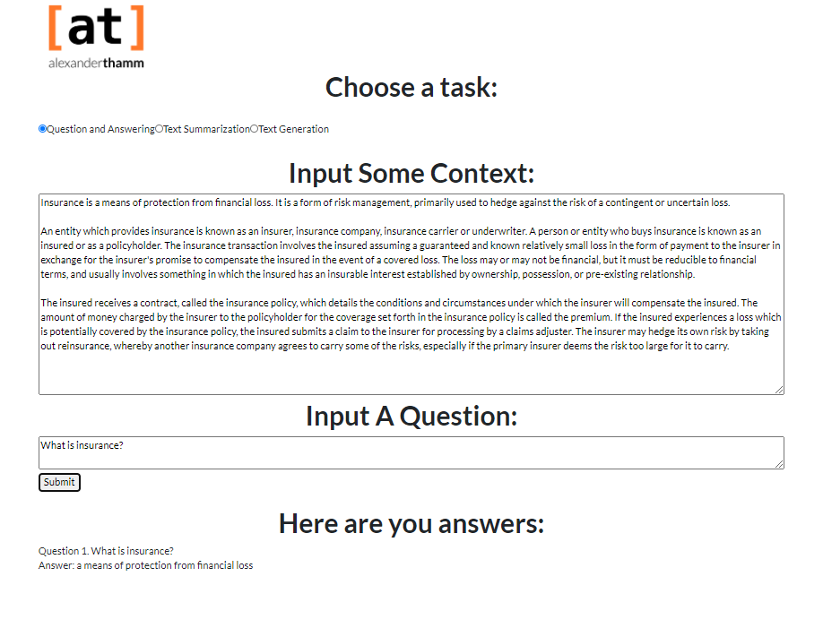
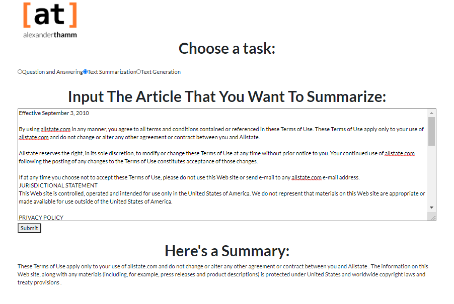

This repository was created for the AT demo of NLP tasks in Insurance.

# How To Run
To run the website, do the following:
- `pip install -r requirements.txt`
- `python main.py` (NOTE: This takes about 30 seconds to initialize)
- Go to `localhost:5050` in your web-browser

This was implemented using the following:
- Plotly Dash
- Huggingface's implementation of Transformers (BERT and GPT2): https://huggingface.co/transformers/

# Examples
Here you could see several examples of the output. It should be noted, however, that the UI is subject to change but more or less, this is what it will look like
### Question and Answering

### Text Summarization

